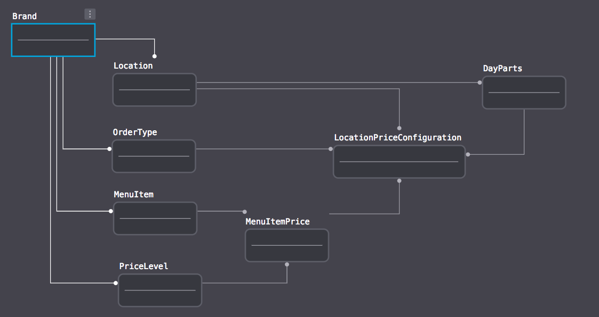
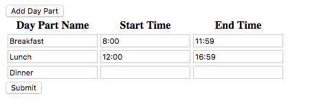
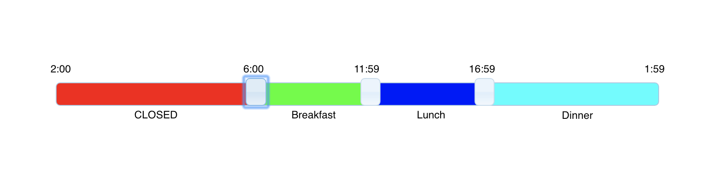

# The Challenge
## Objective
Define and explain a set of data models that facilitate menu item pricing determined by a combination of 3 factors: restaurant location, order type, and time of day.

## Business Requirements
* Each restaurant **Brand** using the SALIDO platform has multiple **Locations**.
* Each **Brand** has various **Menu Items** that may be used by any of its **Locations** (e.g. Cafe Bangarang's FiDi and SoHo locations both sell a "Spicy Reuben").
* Each **Brand** has various **Price Levels** (e.g. `Regular`, `Happy Hour`) that may be used by any of its **Locations**.
* Each **Menu Item** may have a price assigned for each available **Price Level** (e.g. Spicy Reuben Prices: `Regular: $4`, `Happy Hour: $2`).
* Each **Brand** has various **Order Types** (e.g. `Dine In`, `Take Out`, `Delivery`) that may be used by any of its **Locations**. 
* Each **Location** has one or more **Day Parts**, and every moment of the day must be covered by a **Day Part** (e.g. `Breakfast: [02:00, 11:00)`, `Lunch: [11:00, 17:00)`, `Dinner: [17:00, 02:00)`).
* Each **Price Level** is configured by correlating it with an **Order Type** and optional **Day Part**. These configurations are scoped to a **Location**.
  * e.g. For the FiDi location:
    * The "Regular" price level is applied if the order type is "Dine In"
    * The "Happy Hour" price level is applied if the order type is "Dine In" and the day part is "Dinner"
    * The "Delivery" price level is applied if the order type is "Delivery"
* The applicable **Price Level** for any given **Menu Item** is determined at the point of sale by assessing the **Price Level** configurations for the current **Location**. Here's the basic logic:
  * If the **Menu Item** has a price specified for the **Price Level** that correlates with both the current **Order Type** and **Day Part**, use that **Price Level**.
  * Else, if the **Menu Item** has a price specified for the **Price Level** that correlates with only the current **Order Type**, use that **Price Level**.
  * Otherwise, the **Menu Item** has no currently applicable **Price Level** and cannot be purchased.

# The Solution
## The Data Model:


### Model Discussion

The **Brand** is in charge of defining many of the configuration elements that the **Location** will use to manage thier menus.  The Brand will define the values of several lookup tables:  **PriceLevel**, **OrderType**.  The **Brand** will also define what **MenuItems** will be sold and at what price points.

**Brand Class:**

```ruby

class Brand < ActiveRecord::Base
  
  has_many :locations,  dependent: :destroy
  has_many :price_levels,  dependent: :destroy
  has_many :order_types,  dependent: :destroy
  has_many :menu_items,  dependent: :destroy
      
end

```
**Brand Migration:**

```ruby
class CreateBrands < ActiveRecord::Migration
  def change
    create_table :brands do |t|
      t.string :company_name

      t.timestamps null: false
    end
  end
end

```
**Brand Indexes:**

```ruby
class AddIndexToBrand < ActiveRecord::Migration
 def change
        add_index :brands, [:company_name], unique: true
 end
end

```

**Price Levels Class**

```ruby
class PriceLevel < ActiveRecord::Base
  belongs_to :brand
  
  has_many :menu_item_price
  has_many :menu_price_configurations

  validates_uniqueness_of :price_level_name , scope: [:brand], message:  "That Price Level is already created."

end
```

**Price Levels Migration**

```ruby
class CreatePriceLevels < ActiveRecord::Migration
  def change
    create_table :price_levels do |t|
      t.integer :brand_id, null: false 
      t.string :price_level_name

      t.timestamps null: false
    end
  end
end
```


**Price Levels Indexes**

```ruby
class AddIndexToPriceLevel < ActiveRecord::Migration
   def change
        add_index :price_levels, [:brand_id]
        add_index :price_levels, [:price_level_name]
        add_index :price_levels, [:brand_id, :price_level_name], unique: true
    end
end
```

**OrderType Class**

```ruby
class OrderType < ActiveRecord::Base
  belongs_to :brand
  
  has_many :menu_price_configurations

  validates_uniqueness_of :order_type_name , scope: [:brand], message:  "That Order Type is already created."

end
```

**OrderType Migration**

```ruby
class CreateOrderTypes < ActiveRecord::Migration
  def change
    create_table :order_types do |t|
      t.integer :brand_id, null: false 
      t.string :order_type_name

      t.timestamps null: false
    end
  end
end
```


**OrderType Indexes**

```ruby
class AddIndexToOrderType < ActiveRecord::Migration
 def change
        add_index :order_types, [:brand_id]
        add_index :order_types, [:order_type_name]
        add_index :order_types, [:brand_id,:order_type_name], unique: true
    end
end
```

The **Brand** also has muliple **Locations**.  Each one of these locations define the times the location is open and serving with a lookup table: **DayParts**.  It also defines what **MenuItems** are available for that location.  This is done by settting  a **PriceLevel** and an **OrderType** and optionally a **DayPart** in the **LocationPriceConfiguration** model.


**Location Model**

```ruby
class Location < ActiveRecord::Base
  
  belongs_to :brand
  
  has_many :day_parts,  dependent: :destroy
  has_many :menu_price_configurations,  dependent: :destroy
  
  validates_uniqueness_of :location_name , scope: [:brand], message:  "That Location is already created."
  
end

```
**Location Migration**

```ruby
class CreateLocations < ActiveRecord::Migration
  def change
    create_table :locations do |t|
      t.integer :brand_id, null: false 
      t.string :location_name
      t.string :street_address_1
      t.string :street_address_2
      t.string :city
      t.string :state
      t.string :zip_code

      t.timestamps null: false
    end
  end
end
```

**Location Indexes**

```ruby
class AddIndexToLocation < ActiveRecord::Migration
  def change
        add_index :locations, [:brand_id]
        add_index :locations, [:location_name]
        add_index :locations, [:brand_id, :location_name], unique: true
    end
end
```

**DayPart Model**

```ruby
class DayPart < ActiveRecord::Base
  
  belongs_to :location
  
  has_many :menu_price_configurations
  
  validates_uniqueness_of :day_part_name , scope: [:location], message:  "That Time Period is already created."

end
```

**DayPart Migration**

```ruby
class CreateDayParts < ActiveRecord::Migration
  def change
    create_table :day_parts do |t|
      t.integer :location_id, null: false 
      t.string :day_part_name
      t.time :start_time
      t.time :end_time

      t.timestamps null: false
    end
  end
end
```

**DayPart Indexes**

```ruby
class AddIndexToDayParts < ActiveRecord::Migration
  def change
            add_index :day_parts, [:location_id]
            add_index :day_parts, [:day_part_name]
            add_index :day_parts, [:location_id,:day_part_name ], unique: true
  end
end
```


**MenuPriceConfiguration Model**

```ruby
class MenuPriceConfiguration < ActiveRecord::Base
  
  belongs_to :location
  belongs_to :order_type 
  belongs_to :menu_item
  belongs_to :price_level 
  belongs_to :day_part
  
  
  validates :location, presence: true
  validates :order_type, presence: true
  validates :menu_item, presence: true
  validates :price_level, presence: true

  validates_uniqueness_of :menu_item , scope: [:location, :order_type, :price_level, :day_part ], message:  "That Price Configuration is already created."
    
end
```

**MenuPriceConfiguration Migration**

```ruby
class CreateMenuPriceConfigurations < ActiveRecord::Migration
  def change
    create_table :menu_price_configurations do |t|
      t.integer :location_id, null: false 
      t.integer :menu_item_id, null: false 
      t.integer :price_level_id, null: false 
      t.integer :order_type_id, null: false 
      t.integer :day_part_id
        
      t.timestamps null: false
    end
  end
end

```

**MenuPriceConfiguration Indexes**

``` ruby
class AddIndexToLocationPriceConfiguration < ActiveRecord::Migration
  def change
       add_index :menu_price_configurations, [:location_id]
       add_index :menu_price_configurations, [:menu_item_id]
       add_index :menu_price_configurations, [:price_level_id]
       add_index :menu_price_configurations, [:order_type_id]
       add_index :menu_price_configurations, [:location_id, :menu_item_id, :price_level_id, :order_type_id,:day_part_id], name: "index_mpc_on_menu_price_order_daypart", unique: true
  end
end
```

## UI Considerations

In my demo applicaiton below, I am using silverweb_cms gem as the user interface component layer.  This is the CMS gem I developed to allow me to quickly build systems.  It utilizes live edit and instantiation of models to be edited (like creating a folder in the apple finder). It also makes use of a javascript/ruby gem called best-in-place for the live edit fields.  This library was pulled into the CMS gem 3 years ago and heavily modified to support callbacks and validiations. This gives the web applicaton an IOs UI feel and allows me to focus on the business rules and application logic.

###DayParts

The DayParts model is interesting since one of the requirements is that the full day (24h) must be filled for it to be valid.  A simple approach to this using standard a simple form like so:



After submission, validate and report back the errors for the user to fix. Functional but not elegent.  Also it should be easily translatable to mobile devices running IOs and Android.

This problem reminds me of a hard drive tool for partitioning a drive.  You have a limited amount of space and you want to segment it into slices.  In this case the size is *24 hours* and the slices are the **DayParts**.  There are afew jquery solutions.  



With this type of UI solution, the user simply moves the sliders and the  datetimes are ajusted automally, thus eliminating the complex validations.

[jsfiddle example](http://jsfiddle.net/RobertLeeLittleIII/5c7oun1v/)

[Another slider](https://refreshless.com/nouislider/examples/#section-colored-connect)

## Application

Demo System: [salido.silverwebdemo.com/site](http://salido.silverwebdemo.com/site)

There are two users setup for the demo.  

1. the challenge user, access to brands and site widgets.

        User Name:  challenge@salido.com
        Password: password 


2. the admin user, access to everything.

        User Name: admin@noone.com
        Password:  password
        
*Note: Some of the validations are turned off on the curret prototype so that the simplistic interface can geneerate entries for the MenuPriceConfiguration*


